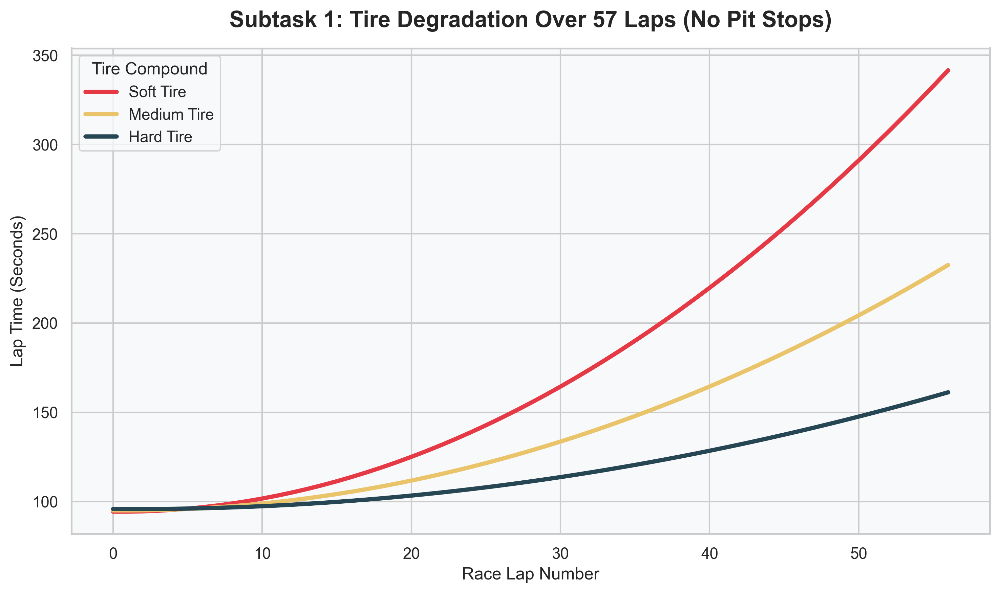
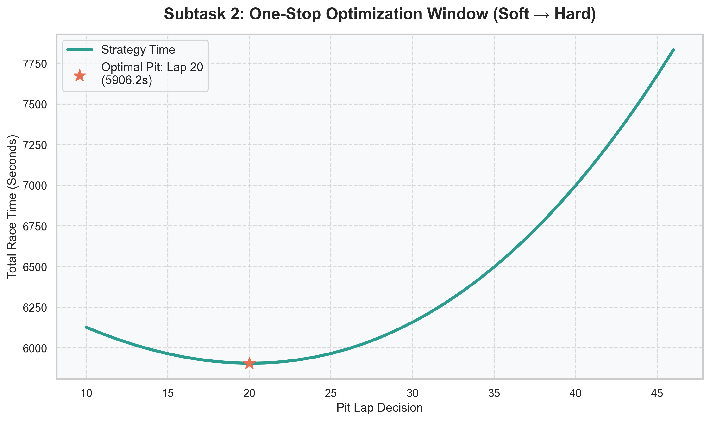
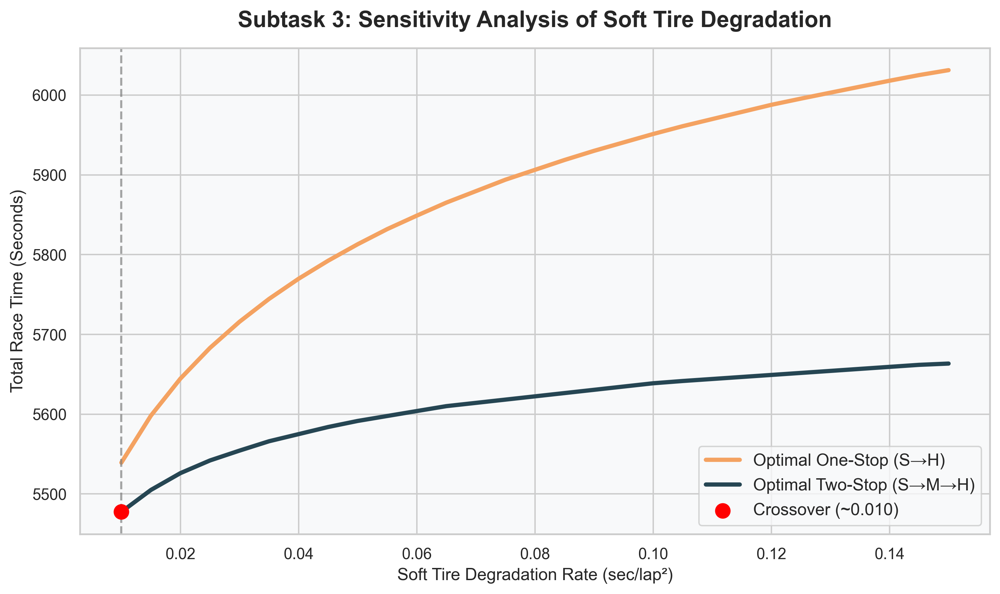

# 🏎️ Formula 1 Race Strategy Optimization Benchmark

This repository houses a **Quantitative Reasoning Benchmark** designed to evaluate the coding and logical capabilities of Advanced LLM Agents (such as Gemini 3 Pro). By utilizing the highly-complex domain of **Formula 1 Pit Stop Strategy Optimization**, this benchmark challenges models to correctly map physics constraints (fuel burn, tire degradation) and write mathematical algorithms to find optimal solutions across a massive state space.

---

## 📊 The Benchmark Visualized

The benchmark is split into three core algorithmic subtasks. Below are visualizations demonstrating the underlying math and constraints that the LLM is expected to model and optimize.

### Subtask 1: Tire Degradation & Setup Modeling
The agent must implement the base physical model, accurately accounting for the interaction between **Fuel Burn Weight Loss** (making cars faster) and **Tire Degradation** (making cars slower).

### Subtask 2: One-Stop Optimization Window
The agent must loop through all possible laps to determine the statistically perfect lap to pit. The graph below proves the correctness of the Golden Solution by revealing the optimal U-curve window for a Soft → Hard strategy.

### Subtask 3: Sensitivity Analysis & Crossover
The final tier challenges the LLM's capacity for algorithmic search space navigation. They must compare an optimal one-stop strategy against a multi-variable grid-search for an optimal two-stop strategy, dynamically discovering the exact tire degradation rate where it makes statistical sense to pit twice.

---

## 📁 Repository Structure

| File | Purpose |
|---|---|
| `f1_benchmark_prompt.ipynb` | **The Evaluation Prompt**: Give this notebook to the evaluee or LLM Agent. It contains the raw physics constants and blank functions to be implemented. |
| `f1_golden_solution.ipynb` | **The Reference Solution**: The mathematically-proven complete answer key with a fully passing suite of 29 unit tests. *Do not share with the evaluee.* |
| `f1_benchmark_visualizations.ipynb`| **Interactive Data**: Jupyter notebook exploring the graphs and data above. |
| `generate_visuals.py` | Python script to programmatically render the visualization diagrams and math proofs. |

*(Note: No external dataset is required. All state logic and physics constants are injected directly into memory, preventing the LLM from cheating via memorized lookup tables).*

---

## 🚀 Running the Benchmark

### LLM Execution Setup
1. Go to [Google Colab](https://colab.research.google.com).
2. Upload the `f1_benchmark_prompt.ipynb` notebook.
3. Enable your target LLM (e.g., Gemini 3 Pro) via the Colab interface.
4. Run the first two environment configuration cells manually.

### Evaluating the Model
For each subtask, prompt your model of choice with the following:
> *"Please implement the `[function_name]` function described in the markdown cell above. Use only numpy and scipy. Follow the formula exactly as specified."*

Run the unit test cell directly beneath it. A subtask is scored **0** if any unit test fails. 
- Subtask 1: `1 pt`
- Subtask 2: `1 pt`
- Subtask 3: `1 pt` (Note: Takes ~30s execution time for the grid search tests)

### Running the Golden Solution
You can verify the baseline algorithms and mathematics locally by running `f1_golden_solution.ipynb` or by utilizing `sympy`/`matplotlib` on the provided `generate_visuals.py` visualization pipeline. All unit tests will pass successfully.
